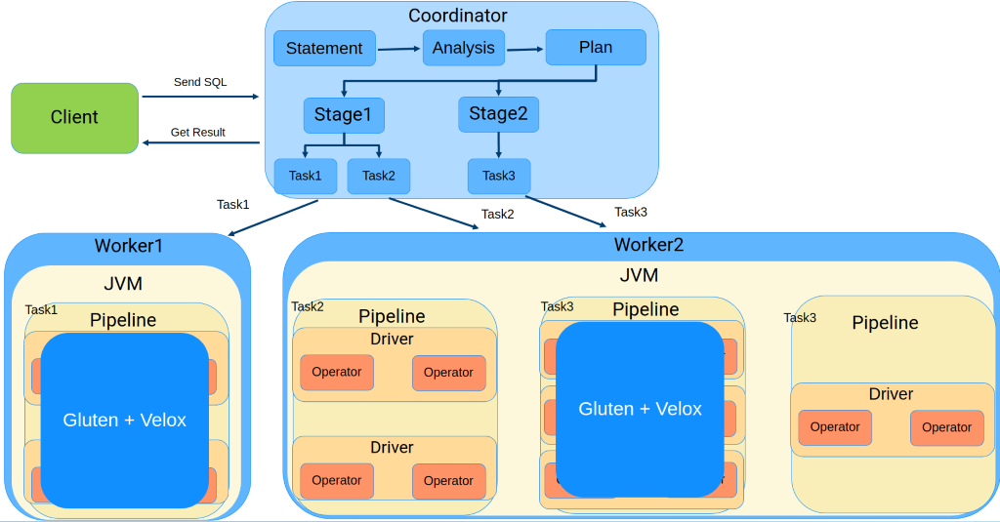

# Gluten-Trino: Plugin to Double Trino's Performance

This plugin is still under active development now, and doesn't have a stable release. Welcome to evaluate it. If you encounter any issues or have any suggestions, please submit to our issue list. We'd like to hear your feedback

## Overview

Gluten Trino is to enable Velox native compute engine for Trino performance acceleration. This project is based on [Trino](https://github.com/trinodb/trino) and [Velox](https://github.com/facebookincubator/velox). Meanwhile we referred a lot from [Prestissimo](https://github.com/prestodb/presto/tree/master/presto-native-execution). We appreciate the excellent work from Trino, Velox and Prestissimo.

## Current Status

Current development is based on Trino 411 release.

All TPC-H queries are supported with all plan fragments offloaded. Currently only Hive-connector was supported.

TPC-DS support is ongoing. Q18 is failed and result of some queries are incorrect.

## Architecture

Gluten-Trino provides task level native offload mechanism via JNI. We will try to translate trino logical plan fragment into native acceptable formats, if the whole plan node tree are supported to be executed in native side, it will offload, otherwise it will fall back to vanilla Java path to execute. Below is Gluten Trino archtecture diagram.



### Plan Fragment Conversion

To minimize develop effort, we reused Prestissimo Plan represenatation and serde framework. Original Prestissmo plan conversion code path is like:
```
PlanFragment(Prestodb-Java) -> Json -> PlanFragment(Prestissimo) -> PlanFragment(Velox)
```
Our solution is translate Trino PlanFragment to Presto-like PlanFragment, and reuse later code path. 
```
PlanFragment(Trino-Java) -> PlanFragment(Gluten-Trino-Java, e.g., Prestodb like) -> Json -> PlanFragment(Gluten-Trino-CPP) -> PlanFragment(Velox)
```

### Data Source/Exchange
For data source, we will convert connector/split info and pass to native, leverage Velox connector to fetch data from data source. Currently, only hive connector is supported.

For exchange and output data, we will serialize Velox RowVector to Trino protocol binary data at native side, and Trino java side will wrap this to ByteBuffer and wait for downstream task to pull data. Downstream native exchange node will pull data and deserialize to Velox RowVector.

## Getting Started
```
git clone --recursive https://github.com/oap-project/Gluten-Trino.git
cd Gluten-Trino
# if you are updating an existing checkout
git submodule sync --recursive
git submodule update --init --recursive
```

### Prerequisite 
It's verfied on x86_64 Linux build on Ubuntu 20.04 or later.
```
# python3
$ pip install regex pyyaml chevron clang-format
$ apt-get install jq
```

### Build Gluten CPP

```
cd ${REPO}/cpp
export TRINO_HOME=/path/to/Gluten-Trino/repo 
make depends # this will install all dependency 
make release
```
Once build completed, you can get `src/libgluten_trino.so` under build dir.

### Build Gluten Java

```
cd ${REPO}/java
mvn clean package -DskipTests=True -Dair.check.skip-duplicate-finder=True
```

## How to use

1. Copy `libgluten_trino.so` to your system `LD_LIBRARY_PATH` on each worker node.
2. Modify `launcher.py`, add `Gluten-Trino-{Trino-version}.jar` to your classpath, make sure it is the first.
3. Add the configs below to your `config.properties` file:
```
query.launch-native-engine=true 
optimizer.optimize-hash-generation=false 
enable-dynamic-filtering=false
gluten-trino.plugin.dir=/path/to/Gluten-Trino-{Trino-version}.jar
```
4. Start Trino server normally.

## Contact
Gluten-Trino was initiated by Intel and Alibaba in 2023. If you are interested in Gluten project, please contact below email address for further discussion.
cheng.a.xu@intel.com; kunshang.ji@intel.com; jiang1.li@intel.com
